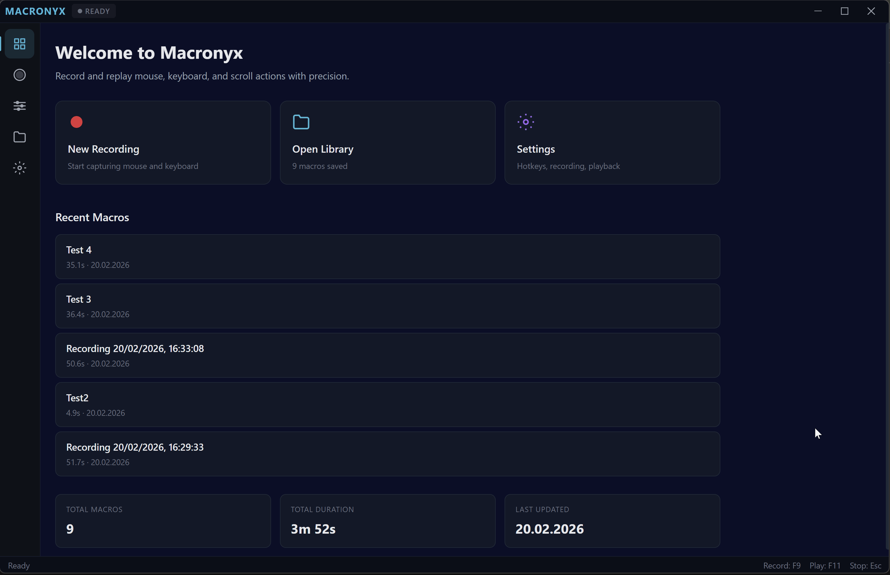

<div align="center">

# MACRONYX

**Cross-platform macro recorder for gamers and power users**

Record and replay mouse movements, clicks, scroll, and keyboard input with precision.

[](https://www.gnu.org/licenses/gpl-3.0)
[](https://github.com/DefinitelyN0tMe/Macronyx/releases)
[](https://github.com/DefinitelyN0tMe/Macronyx/releases)
[](https://github.com/DefinitelyN0tMe/Macronyx/actions)

[Download](#download) | [Features](#features) | [Usage](#usage) | [Build](#build-from-source) | [Contributing](#contributing)

</div>

---

## Features

### Recording
- Record mouse movement, clicks (left/right/middle), and scroll wheel
- Record keyboard input with key hold duration support
- Configurable mouse sampling rate (8ms-100ms)
- Selective capture — toggle mouse, keyboard, or scroll independently
- Real-time event counter and timer during recording
- DPI-aware capture — works correctly on high-DPI / scaled displays

### Playback
- Adjustable playback speed (0.25x to 4x)
- Loop playback with configurable repeat count (or infinite loop)
- Configurable delay between loop iterations
- Pause/resume playback
- Humanization mode — adds natural variance to timing and positions
- DPI-aware playback — pixel-perfect cursor positioning on any display scaling

### Timeline Editor
- Visual timeline with separate mouse and keyboard tracks
- Click to select and edit individual events
- Event inspector panel with editable properties (timestamp, position, key, delay)
- Mouse path visualization canvas showing recorded cursor trajectory
- Undo/redo support
- Zoom and scroll navigation

### Macro Library
- Save and organize recorded macros
- Search macros by name, description, or tags
- Import/export macros in `.macronyx` format
- Grid and list view modes
- Select a macro for hotkey-based playback

### System Integration
- Global hotkeys work even when the app is not focused:
  | Action | Default Hotkey |
  |--------|---------------|
  | Start recording | `F9` |
  | Stop recording | `F10` |
  | Start playback | `F11` |
  | Stop playback | `Shift+F11` |
  | Emergency stop | `Escape` |
- System tray — minimize to tray and control via hotkeys
- All hotkeys are fully customizable in Settings

### Cross-Platform
| Platform | Installer | Portable / Standalone |
|----------|-----------|----------------------|
| Windows  | `.exe` setup | `.exe` portable |
| macOS    | `.dmg` | `.zip` |
| Linux    | `.deb` | `.AppImage` |

---

## Download

**[Download Latest Release](https://github.com/DefinitelyN0tMe/Macronyx/releases/latest)**

> **Windows users**: choose `macronyx-*-setup.exe` for the installer or `macronyx-*-portable.exe` for a single-file portable version.

---

## 🎬 Macronyx in Action

<p align="center">
  
</p>

<p align="center">
  
</p>

<p align="center">
  
</p>

## Usage

### Quick Start

1. Open Macronyx
2. Go to the **Recorder** tab
3. Press `F9` (or click the record button) to start recording
4. Perform your actions — move the mouse, click, scroll, type
5. Press `F10` to stop recording
6. Your macro appears in the **Library** automatically
7. Select a macro and press `F11` to play it back

### Editing Macros

1. Open a macro from the **Library** and click **Edit**
2. Click events on the **Timeline** to select them
3. Use the **Event Inspector** to adjust timestamps, positions, delays, and keys
4. View the cursor path on the **Mouse Path Preview** canvas
5. Undo/Redo for safe editing
6. Click **Save** when done

### Silent Mode

1. Enable **Minimize to Tray** in Settings > General
2. Close the window — Macronyx keeps running in the system tray
3. Use global hotkeys to control recording and playback without the window

### Portable Mode

1. Download the portable `.exe`
2. Launch it, go to **Settings > Advanced** and click **Enable** next to Portable Mode
3. Restart the app — settings and macros are now stored in a `data/` subfolder next to the executable
4. Move the entire folder to a USB drive for on-the-go use

> You can also enable portable mode manually by creating an empty file named `portable` (no extension) next to the exe.

---

## Build from Source

### Requirements

- Node.js 20+
- npm 9+
- Git

#### Linux additional packages

```bash
sudo apt install libx11-dev libxtst-dev libpng-dev
```

### Build

```bash
git clone https://github.com/DefinitelyN0tMe/Macronyx.git
cd Macronyx
npm install
npm run dev          # Development mode with hot reload
npm run build        # Build for production
npm run build:win    # Package for Windows
npm run build:mac    # Package for macOS
npm run build:linux  # Package for Linux
```

---

## Tech Stack

| Component | Technology |
|-----------|-----------|
| Framework | Electron + electron-vite |
| Frontend  | React 19 + TypeScript |
| UI        | Mantine v7 |
| State     | Zustand |
| Input Capture | uiohook-napi |
| Input Simulation | Platform-native (SendInput / xdotool / CGEvent) |
| Packaging | electron-builder |

---

## Platform Notes

### Windows
- No special permissions required
- Works with any DPI scaling (100%-300%+)
- Input simulation uses Win32 `SendInput` API for reliable, DPI-aware playback

### macOS
- Requires **Accessibility** permissions: System Settings > Privacy & Security > Accessibility
- On first launch, right-click > Open to bypass Gatekeeper

### Linux
- Requires X11 (`libx11-dev`, `libxtst-dev`)
- On Wayland, the X11 compatibility layer (XWayland) may be needed
- AppImage: run `chmod +x Macronyx-*.AppImage` before launching

---

## Contributing

Contributions are welcome! See [CONTRIBUTING.md](CONTRIBUTING.md) for details.

---

## Support Development

If you find Macronyx useful, consider supporting the developer:

<a href="https://ko-fi.com/definitelyforme">
  
</a>

---

## Disclaimer

Macronyx is a transparent automation tool designed for productivity, accessibility, and personal use. It does not include any stealth, hidden, or surveillance functionality. Users are responsible for complying with the terms of service of any software they use Macronyx with.

---

<div align="center">
  Made with care by <a href="https://github.com/DefinitelyN0tMe">DefinitelyN0tMe</a>
</div>
