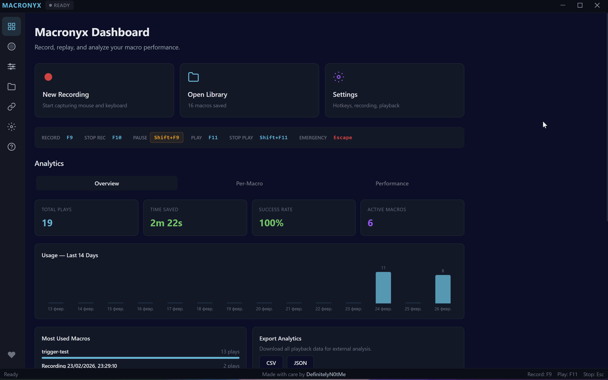
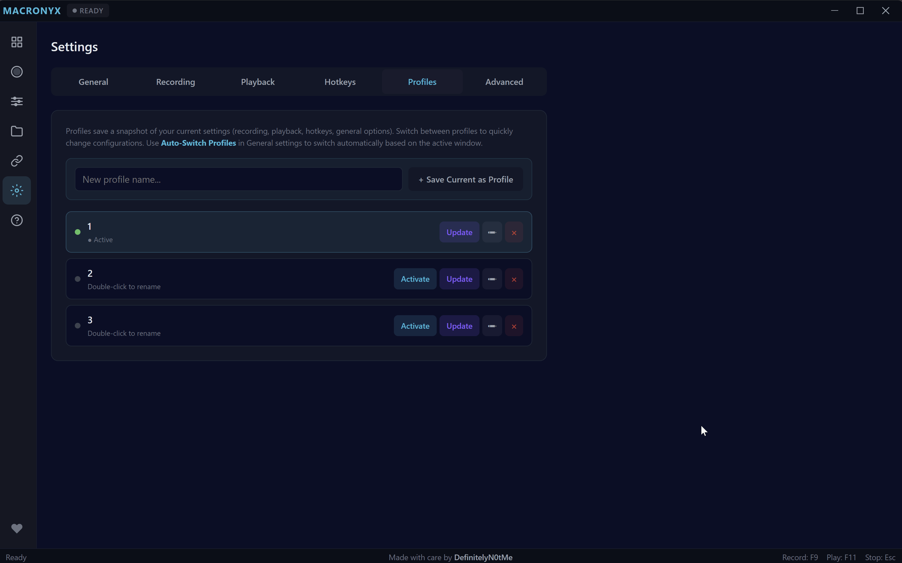

<div align="center">

# MACRONYX

**Desktop automation for gamers and power users**

Record, edit, and replay mouse, keyboard, and scroll actions with sub-millisecond precision.
Chain macros together, trigger them automatically, and track performance with built-in analytics.

[](https://www.gnu.org/licenses/gpl-3.0)
[](https://github.com/DefinitelyN0tMe/Macronyx/releases)
[](https://github.com/DefinitelyN0tMe/Macronyx/releases)
[](https://github.com/DefinitelyN0tMe/Macronyx/actions)

**[Download Latest Release](https://github.com/DefinitelyN0tMe/Macronyx/releases/latest)** &nbsp;&middot;&nbsp; [Features](#features) &nbsp;&middot;&nbsp; [Quick Start](#quick-start) &nbsp;&middot;&nbsp; [Roadmap](ROADMAP.md) &nbsp;&middot;&nbsp; [Contributing](#contributing)

</div>

---

## What's New in v1.6

- **Analytics Dashboard** — track total plays, time saved, success rates, and per-macro performance over time
- **Performance Profiling** — timing drift analysis with mean/P95/max metrics, sparkline charts, and accuracy percentages
- **Relative Positioning v2** — record mouse coordinates relative to windows; macros adapt when windows move or resize
- **Export & Reset Analytics** — download playback history as CSV/JSON, or clear all data with one click
- **Chain Pause/Resume** — proper pause support during chain playback with correct overlay status

See the full [Changelog](CHANGELOG.md) for details.

---

## Features

### Recording

- Capture mouse movement, clicks (left/right/middle), scroll wheel, and keyboard input
- **Pause/resume** mid-recording without stopping
- Configurable mouse sampling rate (8ms–100ms)
- Selective capture — toggle mouse, keyboard, or scroll independently
- **Relative positioning** — record coordinates relative to the active window so macros adapt when windows move or resize
- DPI-aware capture across high-DPI and multi-monitor setups
- Real-time event counter and elapsed timer

### Playback

- Adjustable speed: 0.25x to 4x
- Loop with configurable repeat count and delay between iterations
- Pause/resume at any point
- **Humanization** — natural variance in timing and cursor position
- **Bezier mouse curves** — configurable curvature, overshoot, and speed profiles (constant / ease-in-out / natural)
- **Per-event results** — success/failed/skipped tracking with live overlay counter and post-playback summary
- **Window-aware smart scaling** — coordinates scale proportionally when the target window resizes
- DPI-aware playback with pixel-perfect cursor positioning

### Timeline Editor

- Visual timeline with separate mouse, keyboard, and logic tracks
- **Multi-select**: Ctrl+click, Shift+click range, Ctrl+A select all
- **Drag-and-drop** events to reposition in time
- **Copy/paste** with Ctrl+C / Ctrl+V
- **Event grouping** — named groups with colored timeline bands
- **Batch editing** — offset timestamps, scale delays, assign groups across selections
- **Smart delay smoothing** — moving-average with configurable window and min/max clamping
- Event inspector with editable properties (timestamp, position, key, delay, conditions)
- Mouse path visualization canvas with cursor trajectory preview
- **Playback preview** — animated cursor on canvas with play/pause/seek controls and speed selector
- Auto-save with dirty indicator and navigation guard
- Full undo/redo support

### Automation & Triggers

- **Trigger types:**
  - **Hotkey combo** — press-to-record custom key combinations
  - **Schedule** — cron-based with 16 quick presets (every 5 min, hourly, daily, weekdays, etc.)
  - **Window focus** — fire when a specific app gains focus (process name, title substring, or regex)
  - **Pixel color** — fire when a pixel matches a target color within tolerance; supports repeat mode
- **Conditional logic (IF / ELSE / END):**
  - Pixel color at a position
  - Window title matching (contains, equals, regex)
  - Time of day (after/before)
  - Full nesting support (IF inside IF)
- **Macro chaining** — run macros in sequence (A → B → C) with per-step delays, drag-to-reorder, and enable/disable toggles

### Analytics & Performance

- **Dashboard** with three tabs:
  - **Overview** — total plays, time saved, success rate, active macros, 14-day usage chart, top macros
  - **Per-Macro** — run history, success rate donut chart, average duration, last run timestamp
  - **Performance** — timing drift analysis with mean/P95/max metrics, accuracy percentage, sparkline, and histogram
- **Persistent logging** — every playback run is logged with timestamps, event counts, trigger source, and per-event timing
- **Export** playback data as CSV or JSON
- **Reset** all analytics with a single click (with confirmation)

### Profiles

- Save snapshots of settings as named profiles
- Switch instantly between configurations
- **Auto-switch** profiles based on the foreground application (configurable rules by process name, title, or regex)
- Create, rename, update, and delete from Settings → Profiles

### System Integration

| Action | Default Hotkey |
|--------|:-------------:|
| Start recording | `F9` |
| Stop recording | `F10` |
| Pause / Resume | `Shift+F9` |
| Start playback | `F11` |
| Stop playback | `Shift+F11` |
| Emergency stop | `Escape` |

- All hotkeys are fully customizable and work globally (even when Macronyx is not focused)
- **Floating overlay widget** — compact always-on-top indicator with status, timer, event counter, and progress bar (visible above fullscreen apps)
- **Notification sounds** — audio feedback for recording, playback, and pause actions
- **System tray** — minimize to tray and control entirely via hotkeys
- **Portable mode** — store settings and macros next to the executable for USB use

### Cross-Platform

| Platform | Installer | Portable |
|----------|:---------:|:--------:|
| Windows  | `.exe` setup | `.exe` portable |
| macOS    | `.dmg` | `.zip` |
| Linux    | `.deb` | `.AppImage` |

---

## Download

**[Download Latest Release](https://github.com/DefinitelyN0tMe/Macronyx/releases/latest)**

> **Windows**: choose `macronyx-*-setup.exe` for the installer or `macronyx-*-portable.exe` for a single-file portable version.

---

## Screenshots

<p align="center">
  
</p>

<p align="center">
  
</p>

<p align="center">
  
</p>

---

## Quick Start

1. Open Macronyx
2. Go to the **Recorder** tab
3. Press **F9** to start recording
4. Perform your actions — move the mouse, click, scroll, type
5. Press **F10** to stop recording
6. Your macro appears in the **Library** automatically
7. Select a macro and press **F11** to play it back

### Editing Macros

1. Open a macro from the **Library** and click **Edit**
2. Click events on the **Timeline** to select (Ctrl+click for multi-select, Shift+click for range)
3. Drag events to reposition, or Ctrl+C / Ctrl+V to copy/paste
4. Use the **Event Inspector** to adjust timestamps, positions, delays, and keys
5. Use **Smooth Delays** to clean up irregular recording timing
6. Preview the cursor path on the **Mouse Path** canvas
7. All operations support undo/redo; changes auto-save every 60 seconds

### Triggers & Automation

1. Open a macro in the **Editor** → switch to the **Triggers** tab
2. Click **"+ Add"** and choose a trigger type (hotkey, schedule, window focus, or pixel color)
3. Configure the trigger and toggle it ON, then **Save**
4. Enable triggers globally in **Settings → General → Enable Triggers**

### Macro Chains

1. Go to the **Chains** page from the sidebar
2. Click **"+ New Chain"** and add macros from the dropdown
3. Drag to reorder, set delays between steps, toggle steps on/off
4. Press **Play** or **F11** to execute the chain

### Conditional Logic

1. Open a macro in the **Editor → Timeline** tab
2. Click the **"+ IF"** button in the toolbar
3. Configure the condition in the **Event Inspector** (pixel color, window title, or time of day)
4. Place events between **IF** and **ELSE** (runs when true) or between **ELSE** and **END** (runs when false)
5. Conditions can be nested for complex branching

### Profiles

1. Go to **Settings → Profiles**
2. Click **"Save Current as Profile"** to create a snapshot
3. Click **Activate** to switch; double-click to rename
4. Enable **Auto-Switch Profiles** in Settings to change profiles automatically when apps gain focus

### Silent Mode

1. Enable **Minimize to Tray** in Settings → General
2. Close the window — Macronyx runs in the system tray
3. Use global hotkeys to control recording and playback

### Portable Mode

1. Download the portable `.exe`
2. Go to **Settings → Advanced** and click **Enable** next to Portable Mode
3. Restart — settings and macros are stored in a `data/` folder next to the executable

---

## Build from Source

### Requirements

- Node.js 20+
- npm 9+
- Git

**Linux additional packages:**

```bash
sudo apt install libx11-dev libxtst-dev libpng-dev
```

### Build

```bash
git clone https://github.com/DefinitelyN0tMe/Macronyx.git
cd Macronyx
npm install
npm run dev          # Development mode with hot reload
npm run build        # Build for production
npm run build:win    # Package for Windows
npm run build:mac    # Package for macOS
npm run build:linux  # Package for Linux
```

---

## Tech Stack

| Component | Technology |
|-----------|-----------|
| Framework | Electron + electron-vite |
| Frontend  | React 19 + TypeScript |
| UI        | Mantine v7 |
| State     | Zustand 5 |
| Input Capture | uiohook-napi (global hooks) |
| Input Simulation | Platform-native (Win32 SendInput / xdotool / CGEvent) |
| Analytics | Custom persistent logging with CSV/JSON export |
| Packaging | electron-builder |

---

## Platform Notes

### Windows
- No special permissions required
- Works with any DPI scaling (100%–300%+)
- Multi-monitor support with virtual screen coordinate mapping
- Input simulation uses Win32 `SendInput` for reliable, DPI-aware playback

### macOS
- Requires **Accessibility** permission: System Settings → Privacy & Security → Accessibility
- On first launch, right-click → Open to bypass Gatekeeper

### Linux
- Requires X11 (`libx11-dev`, `libxtst-dev`)
- On Wayland, the X11 compatibility layer (XWayland) may be needed
- AppImage: run `chmod +x Macronyx-*.AppImage` before launching

---

## Roadmap

See [ROADMAP.md](ROADMAP.md) for the full development roadmap.

**Coming next:**
- **v1.7** — Visual UI Anchors (image-region matching), Script Mode, Macro Variables
- **v1.8** — Auto-Updater, Macro Sharing, Light Theme, Localization
- **v2.0** — Plugin System, Cloud Sync, Macro Marketplace, REST API

---

## Contributing

Contributions are welcome! See [CONTRIBUTING.md](CONTRIBUTING.md) for guidelines.

Have a feature idea? [Open an issue](https://github.com/DefinitelyN0tMe/Macronyx/issues) with the **feature request** label.

---

## Support Development

If Macronyx saves you time, consider supporting the developer:

<a href="https://ko-fi.com/definitelyforme">
  
</a>

---

## Disclaimer

Macronyx is a transparent automation tool designed for productivity, accessibility, and personal use. It does not include any stealth, hidden, or surveillance functionality. Users are responsible for complying with the terms of service of any software they use Macronyx with.

---

<div align="center">
  Made with care by <a href="https://github.com/DefinitelyN0tMe">DefinitelyN0tMe</a>
</div>
